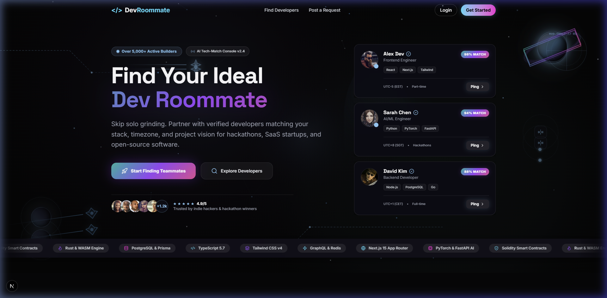

# 🚀 Dev Roommate

[](https://devroommate.vercel.app)

> **Find your ideal technical co-founder, hackathon partner, or SaaS project collaborator.**  
> Built with a calm **Void Black + Icy Blue** visual design, strategic **Aurora Gradient** highlights, real-time WebSockets, and intelligent developer matching algorithms.

---

## 📸 Screenshots

| Hero Console | Developer Search |
| :---: | :---: |
|  |  |

| Real-Time Chat | Dashboard Analytics |
| :---: | :---: |
|  |  |

---

## 🌟 Key Features

### 🌌 Void Black & Aurora Accent Design System
- **Void Black Base**: Deep, distraction-free pure black background (`#050505`–`#0A0A0A`) across all views for maximum visual contrast and modern elegance.
- **Calm Icy Blue Primary**: Icy white-blue palette (`#E0F2FE`–`#7DD3FC`) powering text links, icons, borders, tag pills, search inputs, and subtle UI highlights.
- **Signature Aurora Moments**: Vibrant Teal (`#14F195`) → Violet (`#8B5CF6`) → Magenta (`#FF2BD6`) gradient reserved exclusively for high-impact elements (Hero title, primary CTAs, and match percentage badges).
- **GPU Space Canvas & Motifs**: Multi-layered particle canvas, orbit rings, celestial moons, rocket exhaust trails, and circuit motifs colored in calm icy blue tones.

### ⚡ Developer Discovery & AI Match Engine
- **Intelligent Match Calculations**: Automated compatibility scoring based on tech stack alignment, timezone overlap, project preferences, and experience levels.
- **AI Match Reasoning**: Detailed breakdown explaining *why* two developers match (e.g., complementary stack, shared hackathon timeline).
- **Debounced Fuzzy Search**: Real-time 300ms debounced search bar filtering developers by name, bio, stack, availability, and location.

### 💬 Real-Time Messaging & Ping-to-Chat Bridging
- **Interactive Collaboration Pings**: Send instant collaboration invitations with custom cover notes and status tracking (`pending`, `accepted`, `rejected`).
- **Ping-to-Chat Bridge**: Accepting a collaboration ping automatically instantiates a 1-on-1 chat room between developers.
- **WebSocket Messaging**: Powered by **Pusher WebSockets** and **MongoDB** for instant message delivery, unread counter badges, and real-time chat sorting.

### 📋 Collaboration Requests Board & Applicant Tracking
- **Recruitment Feed**: Post project ideas, hackathon team openings, or open-source initiatives.
- **Applicant Tracking**: Track interested applicants directly on each request card with single-click interest actions (`Interested ✓`).

### 🛠️ Developer Productivity & UI Enhancements
- **Global Command Palette (`Cmd+K` / `Ctrl+K`)**: Fast access keyboard modal to search developers, jump to pages, or perform quick system actions.
- **Dashboard Analytics Chart**: Data visualization chart built with **Recharts** displaying collaboration request stats, ping activity, and match metrics.
- **3-Step Guided Onboarding Wizard**: Step-by-step setup flow guiding new users through profile details, stack tags, and project goals.
- **GitHub OAuth & NextAuth**: Dual authentication via GitHub OAuth and password credentials, featuring automatic account linking on matching emails.
- **Profile Customization & Image Uploader**: Custom profile photo uploader, bio editor, social links (GitHub, LinkedIn, Portfolio), and availability toggles.
- **Mobile Navigation Drawer & Empty States**: Fully responsive mobile navigation menu and custom sci-fi themed empty state views.

---

## 🛠️ Tech Stack

- **Framework**: [Next.js 16 (App Router)](https://nextjs.org/)
- **Styling**: [Tailwind CSS v4](https://tailwindcss.com/), [Framer Motion](https://www.framer.com/motion/), [Lucide Icons](https://lucide.dev/)
- **Data Visualization**: [Recharts](https://recharts.org/)
- **Database & ORM**: [MongoDB Atlas](https://www.mongodb.com/cloud/atlas) via [Mongoose 9](https://mongoosejs.com/)
- **Authentication**: [NextAuth.js v4](https://next-auth.js.org/) (Credentials & GitHub OAuth)
- **Real-Time WebSockets**: [Pusher](https://pusher.com/)
- **State & Data Fetching**: [@tanstack/react-query](https://tanstack.com/query/latest), [Zustand](https://zustand-demo.pmnd.rs/)

---

## 🧠 Challenges & Technical Learnings

- **Diagnosing & Resolving MongoDB Connection Pool Exhaustion**: Fixed transient `MongooseServerSelectionError` failures across Next.js serverless route invocations by implementing a global connection singleton cache (`global.mongoose`), tuning `serverSelectionTimeoutMS` (5000ms), and handling MongoDB connection state machine transitions (`readyState` check for connecting/disconnecting states) to prevent pool leaks during hot-reloads.
- **Normalizing ObjectId vs. String Types in WebSocket Chat Engine**: Resolved inconsistent message alignment and chat bubble placement by enforcing strict `.toString()` ID normalization across Mongoose document references and Pusher WebSocket payloads, ensuring sender/receiver comparisons evaluate correctly regardless of BSON types.
- **Eliminating Next.js Root Layout Hydration Mismatches**: Fixed server-versus-client HTML hydration errors triggered by Google Font CSS variable hashes (`inter.variable`, `spaceGrotesk.variable`) and browser extension attribute injections by purging Turbopack build caches and adding `suppressHydrationWarning` flags to root layout containers.
- **Resilient Fallback Architecture for Read Endpoints**: Built fail-safe fallback data layers for public discovery routes (`/api/users`, `/api/requests`), ensuring the application gracefully degrades to cached datasets during transient database network latency or maintenance without crashing user sessions.

---

## 📁 Project Structure

```text
dev-roommate/
├── src/
│   ├── app/                    # Next.js App Router pages & API routes
│   │   ├── api/                # REST API endpoints (auth, users, pings, requests, chats)
│   │   │   ├── auth/           # NextAuth credentials & GitHub OAuth routes
│   │   │   ├── pings/          # Collaboration ping management & chat creation bridge
│   │   │   ├── requests/       # Recruitment posts & applicant interest APIs
│   │   │   ├── seed/           # Protected database seeder route
│   │   │   └── users/          # Developer query & profile update APIs
│   │   ├── dashboard/          # Analytics dashboard & activity charts
│   │   ├── developers/         # Developer discovery console
│   │   ├── messages/           # Real-time WebSocket chat room
│   │   ├── profile/            # User profile view & edit forms
│   │   ├── requests/           # Collaboration requests feed
│   │   ├── globals.css         # Tailwind v4 theme tokens, glassmorphism, & aurora utilities
│   │   ├── layout.tsx          # Root layout & space background provider
│   │   └── page.tsx            # Landing page hero section
│   ├── components/             # Reusable UI & background components
│   │   ├── AerospaceMotifs.tsx      # Space background visuals (orbit rings, PCB traces)
│   │   ├── DeveloperCard.tsx        # Developer preview card with match badge
│   │   ├── FilterBar.tsx            # Search filter console with debounced input
│   │   ├── HeroBackgroundCanvas.tsx # Particle background canvas
│   │   ├── HeroSection.tsx          # Landing hero console
│   │   ├── Navbar.tsx               # Fixed header with unread indicators & mobile drawer
│   │   ├── PingCard.tsx             # Collaboration ping invitation component
│   │   └── ProfilePhotoUploader.tsx # Avatar image upload component
│   ├── data/                   # Seed data & developer dataset constants
│   ├── lib/                    # Database connection, auth config, & Pusher helpers
│   └── models/                 # Mongoose schemas (User, CollabRequest, Ping, Chat, Message)
├── public/                     # Static assets & screenshots
└── README.md
```

---

## ⚙️ Getting Started

### Prerequisites

- **Node.js**: v18.0.0 or higher
- **npm**: v9.0.0 or higher
- **Database**: [MongoDB Atlas](https://www.mongodb.com/cloud/atlas) cluster (recommended) or local MongoDB instance

---

### Installation & Local Setup

1. **Clone the Repository**
   ```bash
   git clone https://github.com/your-username/dev-roommate.git
   cd dev-roommate
   ```

2. **Install Dependencies**
   ```bash
   npm install
   ```

3. **Configure Environment Variables**
   Create a `.env` file in the root directory:
   ```env
   # Database Connection (MongoDB Atlas recommended)
   MONGODB_URI=mongodb+srv://<username>:<password>@cluster.mongodb.net/devroommate?retryWrites=true&w=majority

   # NextAuth Authentication
   NEXTAUTH_SECRET=your_nextauth_secret_key_here
   NEXTAUTH_URL=http://localhost:3000

   # GitHub OAuth Credentials (Optional)
   GITHUB_CLIENT_ID=your_github_client_id
   GITHUB_CLIENT_SECRET=your_github_client_secret

   # Pusher Real-Time WebSockets (Optional for live messaging)
   PUSHER_APP_ID=your_pusher_app_id
   PUSHER_KEY=your_pusher_key
   PUSHER_SECRET=your_pusher_secret
   NEXT_PUBLIC_PUSHER_KEY=your_pusher_key
   NEXT_PUBLIC_PUSHER_CLUSTER=your_pusher_cluster
   ```

4. **Run Database Seed (Safeguarded)**
   Seed sample developer profiles to test matching (skips automatically if users exist):
   ```bash
   # Open in browser or call via curl:
   http://localhost:3000/api/seed
   ```

5. **Start Development Server**
   ```bash
   npm run dev
   ```

6. **Open Application**
   Navigate to [http://localhost:3000](http://localhost:3000) in your browser.

---

## 📜 Available Scripts

| Script | Description |
| :--- | :--- |
| `npm run dev` | Starts the Next.js development server with fast refreshing |
| `npm run build` | Compiles production bundle and checks TypeScript types |
| `npm run start` | Runs the compiled production build |
| `npm run lint` | Runs ESLint to check for formatting and type safety |

---

## 📄 License

This project is open source and available under the [MIT License](LICENSE).
